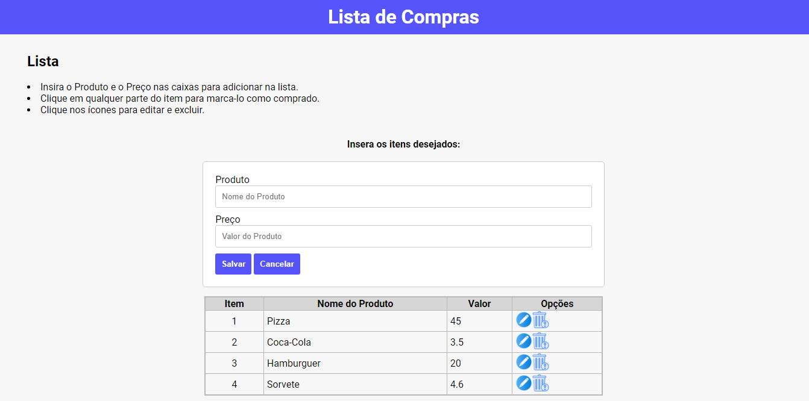
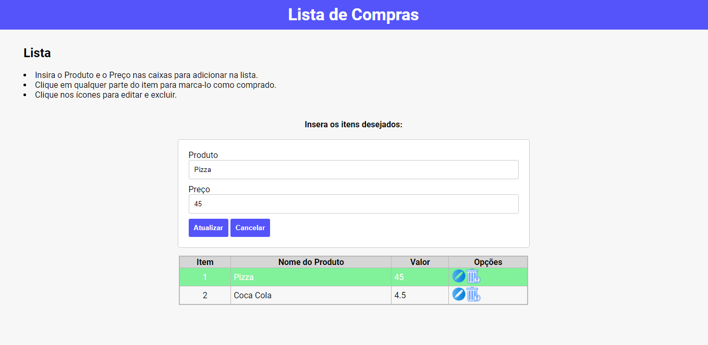
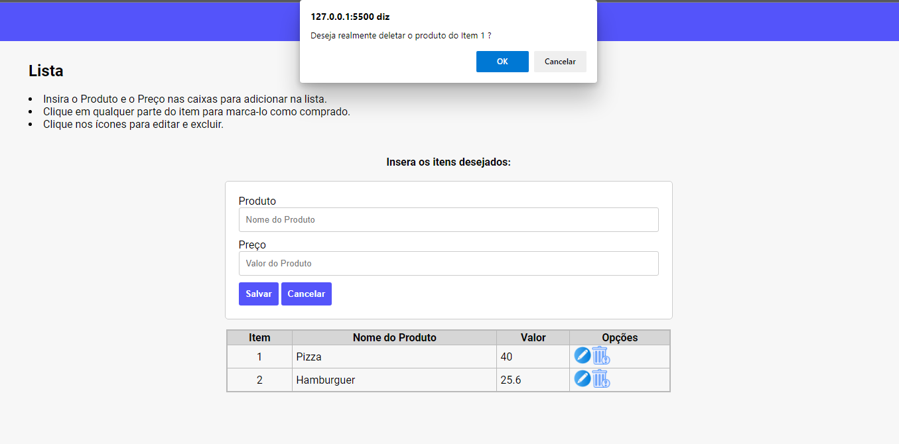

# Projeto 01 - Módulo 01 - Devinhouse Turma NDD

## Projeto desenvolvido para o curso DEVinHouse - Turma NDD 🚀





<h2>Tecnologias Usadas</h2>  
<ul>
    <li>Html</li>
    <li>CSS</li>
    <li>JavaScript</li>    
</ul>

<h2>Resultados de Desenvolvimento</h2>  
<ul>
    <li>Cadastro de uma lista simples de compras</li>
    <li>Inclusão de cada item em um card principal contendo item e preco</li>
    <li>Cada item e salvo em uma tabela</li>
    <li>Selecione o arquivo já icluso na lista, ficará na cor verde.</li>
    <li>Existe dois botões de alteracao e exclusao.</li>
    <li>Ao alterar o mesmo será alterado na tabela.</li>
    <li>Ao excluir aparecera um popup perguntando se tem certeza que quer efetuar a exclusao</li>    
</ul>

<h2>✒️Desenvolvido por </h2>
<h3>Lucas Lucindo da Silva</h3>

## Como rodar o projeto?
### Você precisará:

### Clonar este repositório no terminal:
```
$ git clone 
```

<ul>
    <li>Visual Studio Code (recomendado)</li>
    <li>Execute o arquivo index.html em qualquer browser</li>
</ul>


